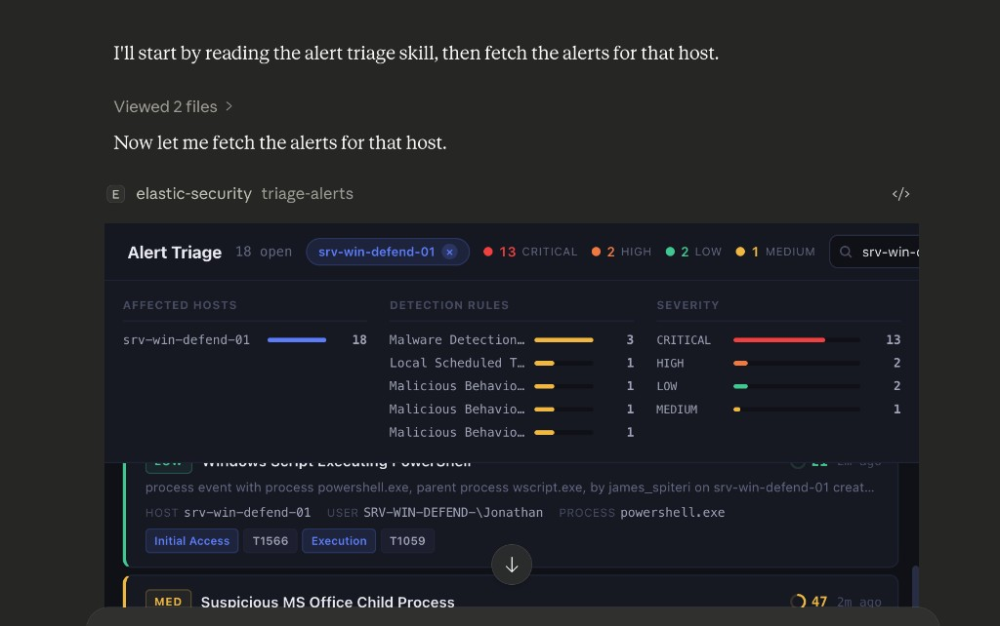
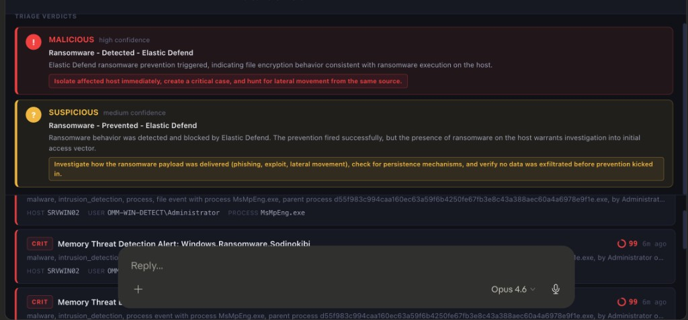
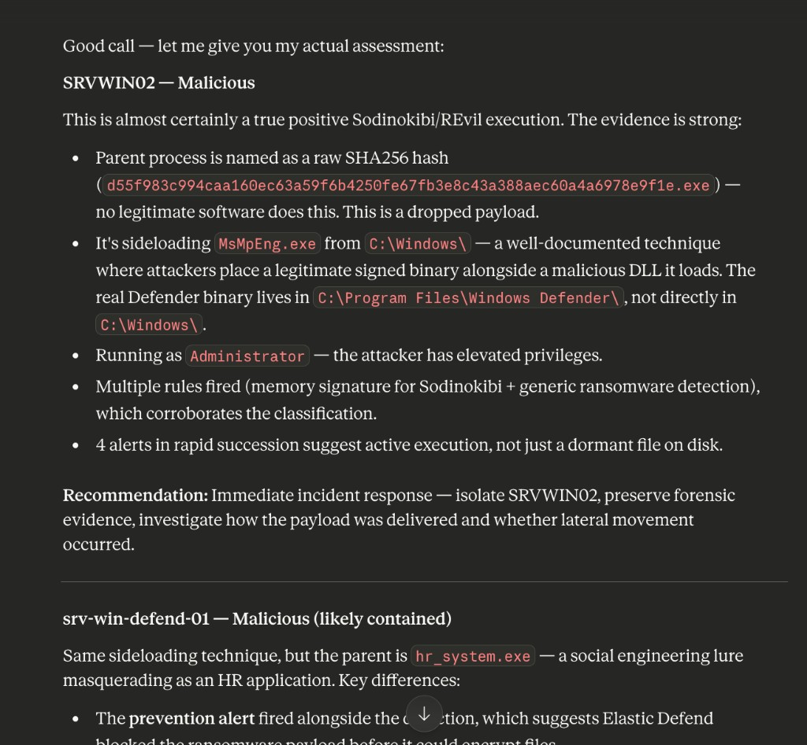
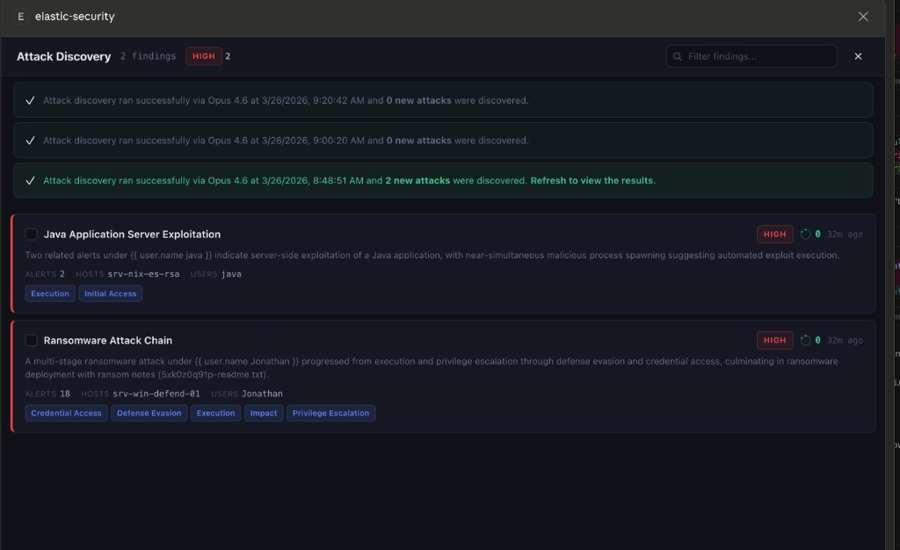
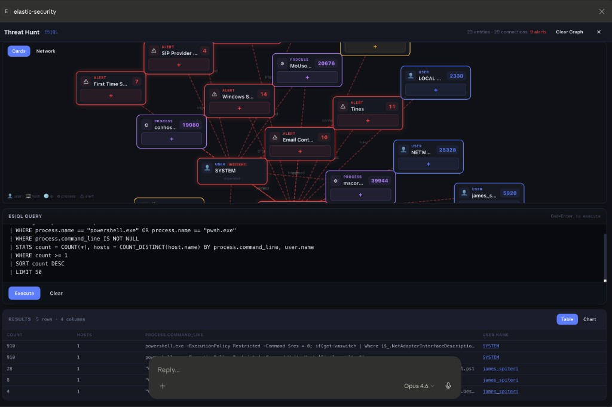
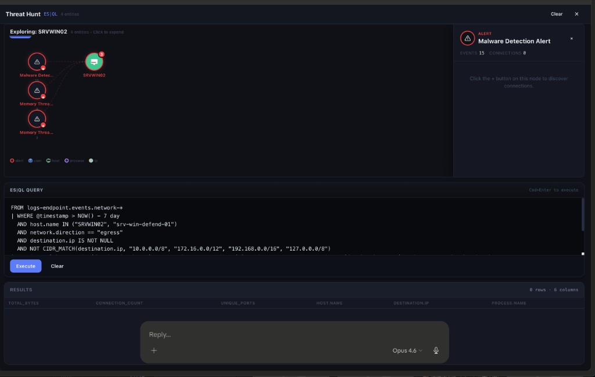
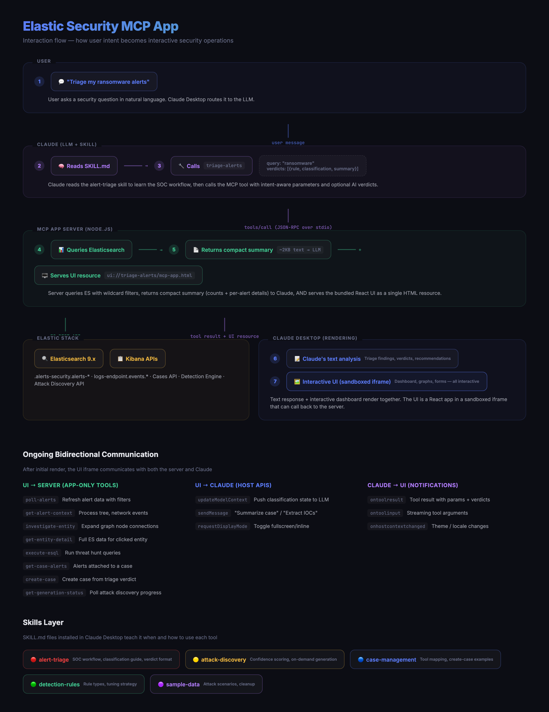

# Elastic Security MCP App

An [MCP App](https://modelcontextprotocol.io/extensions/apps/overview) that brings interactive blue-team security operations directly into Claude, VS Code, and other MCP-compatible AI hosts. Built on the [Model Context Protocol](https://modelcontextprotocol.io/) with interactive UI extensions that render inline in the conversation.

> **What are MCP Apps?** MCP Apps extend the Model Context Protocol to let tool servers return interactive HTML interfaces — dashboards, forms, visualizations — that render inside the AI conversation. The LLM calls a tool, and instead of just returning text, an interactive UI appears alongside the response.



## What This Does

This project provides six interactive security operations tools, each with a rich React-based UI that renders inline when Claude (or another MCP host) calls the tool:

| Tool | What It Does | UI |
|------|-------------|-----|
| **Alert Triage** | Fetch, filter, and triage security alerts | Dashboard with severity grouping, host grouping, AI verdict cards, process tree, network investigation |
| **Attack Discovery** | AI-powered correlated attack chain analysis | Attack narrative cards with confidence scoring, entity risk, MITRE mapping, on-demand generation |
| **Case Management** | Create, search, and manage SOC investigation cases | Case list with alerts/observables/comments tabs, markdown rendering, AI-generated avatars, AI actions |
| **Detection Rules** | Browse, tune, and manage detection rules | Rule browser with KQL search, query validation, noisy rules analysis |
| **Threat Hunt** | ES\|QL workbench with entity investigation graph | Query editor with auto-execute, clickable entities, D3 investigation graph with entity detail panels |
| **Sample Data** | Generate ECS security events for demos | Scenario picker for 4 attack chains |

## Screenshots

### Alert Triage with AI Verdicts
Claude analyzes alerts and provides structured verdicts (Malicious/Suspicious/Benign) that render as visual cards in the dashboard.



### Claude's Triage Analysis
Claude provides detailed attack chain analysis with MITRE ATT&CK mapping, host grouping, and recommended actions.



### Attack Discovery
On-demand AI-powered attack chain analysis with generation progress banners, confidence scoring, and MITRE tactics mapping.



### Threat Hunt & Investigation Graph
Interactive entity investigation graph with progressive expansion, hover-to-trace connections, draggable nodes, and entity detail panels.



### Entity Detail Panel
Click any node in the graph to see real Elasticsearch data — alert details, process info, host activity, network connections.



## How It Works



```
┌─────────────────────────────────────────────┐
│          MCP Host (Claude Desktop)          │
│                                             │
│  User: "Triage my ransomware alerts"        │
│           │                                 │
│           ▼                                 │
│  Claude reads the skill → calls             │
│  triage-alerts with query: "ransomware"     │
│  and verdicts: [{rule, classification}]     │
│           │                                 │
│           ▼                                 │
│  ┌─────────────────────────────────────┐    │
│  │    Interactive Alert Triage UI      │    │
│  │  ┌──────────┐ ┌──────────────────┐  │    │
│  │  │ Verdict  │ │ Alert List       │  │    │
│  │  │ Cards    │ │ (grouped by host)│  │    │
│  │  ├──────────┤ ├──────────────────┤  │    │
│  │  │ Summary  │ │ Detail View      │  │    │
│  │  │ Panel    │ │ Process Tree     │  │    │
│  │  └──────────┘ │ Network / MITRE  │  │    │
│  │               └──────────────────┘  │    │
│  └─────────────────────────────────────┘    │
│                                             │
│  Claude: "6 ransomware alerts found.        │
│  SRVWIN02: Malicious — Sodinokibi/REvil    │
│  active execution via DLL sideloading..."   │
└─────────────────────────────────────────────┘
          │                    ▲
          │ tools/call         │ tool result
          ▼                    │
┌─────────────────────────────────────────────┐
│         MCP App Server (this project)       │
│                                             │
│  35+ tools (6 model-facing + 29 app-only)   │
│  6 interactive UI resources (React/HTML)    │
│  Elastic API client (ES + Kibana)           │
└─────────────────────────────────────────────┘
          │                    ▲
          │ REST API           │ JSON
          ▼                    │
┌─────────────────────────────────────────────┐
│            Elastic Stack                    │
│  Elasticsearch 8.x/9.x  •  Kibana 9.x     │
│  .alerts-security.alerts-*                  │
│  logs-endpoint.events.process-*             │
│  logs-endpoint.events.network-*             │
│  Attack Discovery API                      │
└─────────────────────────────────────────────┘
```

### The Two Types of Tools

- **Model-facing** (`triage-alerts`, `triage-attack-discoveries`, `manage-cases`, `manage-rules`, `threat-hunt`, `generate-sample-data`, `generate-attack-discovery`): The LLM calls these. Each returns a compact text summary AND renders an interactive UI.
- **App-only** (`poll-alerts`, `get-alert-context`, `investigate-entity`, `get-entity-detail`, `execute-esql`, `get-case-alerts`, `get-case-comments`, etc.): Hidden from the LLM. The UI calls these for interactivity.

### Skills

The `skills/` directory contains [Claude Skills](https://claude.com/docs/skills/overview) — `SKILL.md` files that teach Claude *when* and *how* to use the tools. See [Installation → Skills](#skills) for setup.

## Features in Detail

### Alert Triage

The primary SOC workflow. Claude acts as a senior analyst:

- **Intent-aware filtering**: "triage ransomware alerts" → filters by rule name, host, user, process with OR logic
- **AI verdict cards**: Claude can pass structured classifications per rule that render as colored cards
- **Summary panel**: host/rule/severity bar charts at a glance
- **Alert list grouped by host**: collapsible sections, severity-colored left borders
- **Two-pane detail view**: click any alert for metadata, process tree, network events, related alerts
- **Threat classifier**: Benign/Suspicious/Malicious buttons that auto-create cases and attach alerts
- **MITRE ATT&CK tags** throughout
- **Fullscreen toggle** and search

### Attack Discovery

AI-powered correlated attack chain analysis using Elastic's Attack Discovery API:

- **On-demand generation**: "run attack discovery using Opus 4.6" triggers analysis via any AI connector
- **Progress banners**: blue spinner during generation, green success when complete (Kibana-style)
- **Confidence scoring**: each finding scored by alert diversity, rule frequency, entity risk
- **Attack flow diagrams**: visual entity relationship graphs per finding
- **MITRE tactics mapping**: colored pills for each tactic in the kill chain
- **Approve/reject workflows**: bulk triage discovered attacks
- **Auto-polling**: refreshes every 10s during active generation

### Threat Hunt & Investigation Graph

ES|QL query workbench with a Sentinel-style entity investigation graph:

- **Auto-execute**: Claude's pre-populated queries run immediately
- **Clickable entities**: user.name, host.name, IPs, process.name in results are clickable links
- **Progressive graph**: click `+` to expand one entity at a time — you control the investigation path
- **Two graph views**: Cards (left-to-right tree) and Network (D3 force-directed)
- **Hover-to-trace**: hover a node to highlight only its direct connections, everything else dims
- **Draggable nodes**: reposition nodes with edges following in real-time
- **Entity detail panel**: click a node to see real ES data (alert details, process info, network connections, activity timeline)
- **Alert highlighting**: nodes connected to alerts get red dashed rings
- **Charts**: Table/Chart toggle for aggregation queries
- **Overflow groups**: "+N more" for entity types with many connections

### Case Management

Interactive case dashboard with the Kibana Cases API:

- **Tabbed detail view**: Overview (markdown-rendered), Alerts (fetched from ES with full details), Observables (hashes, IPs, domains), Comments (with avatars and markdown)
- **Case IDs**: `#42` visible in list and detail
- **AI-generated avatars**: unique geometric SVG identicons per user
- **Markdown rendering**: case descriptions and comments rendered as rich HTML
- **AI action buttons**: Summarize case, Suggest next steps, Extract IOCs, Generate timeline — each sends a prompt to Claude via `app.sendMessage`
- **Auto-attach alerts**: classifying an alert creates a case AND attaches the alert
- **Summary stats bar**: Total, Open, In Progress, High/Critical counts
- **Refresh button** and fullscreen toggle

### Detection Rules

Rule management dashboard:

- KQL search, severity borders, enabled/disabled indicator, MITRE tags
- Rule detail with query block, validation panel
- Noisy rules analysis (top rules by alert volume with bar chart)
- Enable/disable toggle

### Sample Data Generator

Generate ECS-compliant security events:
- Windows Credential Theft, AWS Privilege Escalation, Okta Identity Takeover, Ransomware Kill Chain
- All data tagged for safe cleanup

## Installation

### Skills

Skills teach your AI agent *when* and *how* to use the tools. You can install them using the `skills` CLI with `npx`, or by cloning this repository and running the bundled installer script. The `npx` method requires Node.js with `npx` available in your environment.

#### npx (Recommended)

The fastest way to install skills — no need to clone this repository:

```sh
npx skills add elastic/example-mcp-app-security
```

This launches an interactive prompt to select skills and [target agents](https://github.com/vercel-labs/skills?tab=readme-ov-file#supported-agents). The CLI copies each skill folder into the correct location for the agent to discover.

Install all skills to all agents (non-interactive):

```sh
npx skills add elastic/example-mcp-app-security --all
```

#### Local clone

If you prefer to work from a local checkout, or your environment does not have Node.js / npx, clone the repository and use the bundled bash installer:

```sh
git clone https://github.com/elastic/example-mcp-app-security.git
cd example-mcp-app-security
./scripts/install-skills.sh add -a <agent>
```

The script requires bash 3.2+ and standard Unix utilities (`awk`, `find`, `cp`, `rm`, `mkdir`).

| Flag | Description |
|------|-------------|
| `-a, --agent` | Target agent (repeatable) |
| `-s, --skill` | Install specific skills by name or glob |
| `-f, --force` | Overwrite already-installed skills |
| `-y, --yes` | Skip confirmation prompts |

List all available skills:

```sh
./scripts/install-skills.sh list
```

#### Claude Desktop (zip upload)

Download the skill zips from the [latest GitHub release](https://github.com/elastic/wip-example-mcp-app-security/releases/latest):

- `alert-triage.zip`
- `attack-discovery-triage.zip`
- `case-management.zip`
- `detection-rule-management.zip`
- `generate-sample-data.zip`

In Claude Desktop: **Customize → Skills → Create Skill → Upload a skill** → upload each zip individually.

If you're building from source, you can generate the zips locally:

```bash
npm run skills:zip
# Produces dist/skills/<skill-name>.zip for each skill
```

#### Supported agents

| Agent | Install directory |
|-------|-------------------|
| claude-code | `.claude/skills` |
| cursor | `.agents/skills` |
| codex | `.agents/skills` |
| opencode | `.agents/skills` |
| pi | `.pi/agent/skills` |
| windsurf | `.windsurf/skills` |
| roo | `.roo/skills` |
| cline | `.agents/skills` |
| github-copilot | `.agents/skills` |
| gemini-cli | `.agents/skills` |

#### Updating skills

**npx:** Check whether any installed skills have changed upstream, then pull the latest:

```sh
npx skills check
npx skills update
```

**Local clone:** Re-run the installer with `--force` to overwrite existing skills:

```sh
git pull
./scripts/install-skills.sh add -a <agent> --force
```

Without `--force` the script skips skills that are already installed.

### MCP Server

#### Claude Desktop

**One-click install:** Download `elastic-security-mcp-app.mcpb` from the [latest GitHub release](https://github.com/elastic/wip-example-mcp-app-security/releases/latest) and double-click it. Claude Desktop shows an install dialog with a settings UI for your Elasticsearch and Kibana credentials. Sensitive values (API keys) are stored in the OS keychain. No Node.js, cloning, or config-file editing required.

**Manual config (build from source):** Add to `~/Library/Application Support/Claude/claude_desktop_config.json`:

```json
{
  "mcpServers": {
    "elastic-security": {
      "command": "node",
      "args": ["/path/to/example-mcp-app-security/dist/main.js", "--stdio"],
      "env": {
        "ELASTICSEARCH_URL": "https://your-cluster.es.cloud.example.com",
        "ELASTICSEARCH_API_KEY": "your-api-key",
        "KIBANA_URL": "https://your-cluster.kb.cloud.example.com",
        "KIBANA_API_KEY": "your-kibana-api-key"
      }
    }
  }
}
```

Restart Claude Desktop. The tools appear under the MCP connector menu.

#### VS Code / Cursor

**Via npx (recommended):** Add to your user or workspace `.vscode/mcp.json` (requires Node.js 22+):

```json
{
  "servers": {
    "elastic-security": {
      "command": "npx",
      "args": [
        "-y",
        "https://github.com/elastic/wip-example-mcp-app-security/releases/latest/download/elastic-security-mcp-app.tgz",
        "--stdio"
      ],
      "env": {
        "ELASTICSEARCH_URL": "https://your-cluster.es.cloud.example.com",
        "ELASTICSEARCH_API_KEY": "your-api-key",
        "KIBANA_URL": "https://your-cluster.kb.cloud.example.com",
        "KIBANA_API_KEY": "your-kibana-api-key"
      }
    }
  }
}
```

> **Pinning a version:** Replace `elastic-security-mcp-app.tgz` with `elastic-security-mcp-app-<version>.tgz` (e.g., `elastic-security-mcp-app-0.2.0.tgz`).

**Manual config (build from source):** Same file, pointing to your local build:

```json
{
  "servers": {
    "elastic-security": {
      "command": "node",
      "args": ["/path/to/example-mcp-app-security/dist/main.js", "--stdio"],
      "env": {
        "ELASTICSEARCH_URL": "...",
        "ELASTICSEARCH_API_KEY": "...",
        "KIBANA_URL": "...",
        "KIBANA_API_KEY": "..."
      }
    }
  }
}
```

#### Claude.ai

Run the server locally and expose it via tunnel:

```bash
npm start
npx cloudflared tunnel --url http://localhost:3001
# Add the generated URL as a custom MCP connector in Claude.ai settings
```

## Building from Source

### Prerequisites

- **Node.js 22+**
- **Elasticsearch 8.x or 9.x** with Security enabled
- **Kibana 8.x or 9.x** (for cases, rules, and attack discovery)
- **API keys** for both Elasticsearch and Kibana
- **Claude Desktop**, **Claude.ai**, or another MCP-compatible host

### Quick Start

```bash
git clone https://github.com/elastic/wip-example-mcp-app-security.git
cd example-mcp-app-security
npm install

cp .env.example .env
# Edit .env with your Elasticsearch/Kibana URLs and API keys

npm run build

npm start
# Server runs on http://localhost:3001/mcp
```

Then configure your MCP host using one of the manual config options under [MCP Server](#mcp-server) above.

## Architecture

```
example-mcp-app-security/
├── main.ts                         # Entry: HTTP + stdio transport
├── src/
│   ├── server.ts                   # MCP server: registers all tools + resources
│   ├── elastic/                    # Elasticsearch/Kibana API client
│   │   ├── client.ts              # Shared fetch wrapper with auth
│   │   ├── alerts.ts              # Alert queries (fetch, search, acknowledge)
│   │   ├── attack-discovery.ts    # Attack Discovery API (find, generate, status)
│   │   ├── cases.ts               # Kibana Cases API (CRUD, comments, alerts, observables)
│   │   ├── rules.ts               # Detection Engine API (rules, exceptions)
│   │   ├── esql.ts                # ES|QL query execution
│   │   ├── indices.ts             # Index listing and field mappings
│   │   ├── investigate.ts         # Entity investigation queries (graph expansion)
│   │   ├── entity-detail.ts       # Per-entity ES queries (alert, host, user, process, IP)
│   │   └── sample-data.ts         # ECS event generation
│   ├── tools/                      # MCP tool definitions
│   │   ├── alert-triage.ts        # triage-alerts + poll/ack/context tools
│   │   ├── attack-discovery.ts    # triage/generate attack discoveries + status
│   │   ├── case-management.ts     # manage-cases + CRUD + comments + alerts
│   │   ├── detection-rules.ts     # manage-rules + find/toggle/validate tools
│   │   ├── threat-hunt.ts         # threat-hunt + execute-esql + investigate + entity-detail
│   │   └── sample-data.ts         # generate-sample-data + cleanup
│   ├── views/                      # React UIs (one per capability)
│   │   ├── alert-triage/          # Alert triage dashboard
│   │   ├── attack-discovery/      # Attack discovery triage + flow diagrams
│   │   ├── case-management/       # Case management with tabs
│   │   ├── detection-rules/       # Rule management dashboard
│   │   ├── threat-hunt/           # ES|QL workbench + investigation graph
│   │   └── sample-data/           # Sample data generator
│   └── shared/                     # Shared UI components
│       ├── base.css               # Design system (tokens, animations, components)
│       ├── theme.ts               # Host theme integration + timeAgo
│       ├── severity.tsx           # Severity badges, dots, colors
│       ├── avatar.tsx             # AI-generated geometric SVG avatars
│       ├── mitre.tsx              # MITRE ATT&CK tag display
│       ├── types.ts               # TypeScript types
│       └── extract-tool-text.ts   # Tool result parsing utilities
├── skills/                         # Claude Desktop Skills
│   ├── alert-triage/              # SOC triage methodology + classification guide
│   ├── attack-discovery-triage/   # Attack discovery triage workflows
│   ├── case-management/           # Case CRUD + tool mapping
│   ├── detection-rule-management/ # Rule tuning methodology
│   └── generate-sample-data/      # Demo data workflows
├── vite.config.ts                  # Vite + React + Tailwind + single-file bundler
├── scripts/build-views.js          # Builds each view into a self-contained HTML file
└── package.json
```

### How Views Are Built

Each view is a React app bundled into a **single self-contained HTML file** using [vite-plugin-singlefile](https://github.com/niclasfin/vite-plugin-singlefile). All CSS, JavaScript, and assets are inlined. The MCP server reads these HTML files and serves them as `ui://` resources. The MCP host renders them in a sandboxed iframe.

### How the UI Communicates

The UI (React app in iframe) communicates with the MCP server through the host:

- **`app.callServerTool()`**: UI calls app-only tools on the server
- **`app.ontoolresult`**: UI receives the tool result when the LLM calls the model-facing tool
- **`app.ontoolinput`**: UI receives tool arguments as the LLM generates them (used for verdict streaming)
- **`app.updateModelContext()`**: UI pushes state back to the LLM's context
- **`app.sendMessage()`**: UI sends messages to the conversation (used for AI case actions)
- **`app.requestDisplayMode()`**: UI can request fullscreen

## Key Design Decisions

### Compact Tool Results
Model-facing tools return **compact summaries** (~1-5KB) to the LLM, not full Elasticsearch documents (800KB+). The UI independently loads full data via app-only tools.

### Self-Loading UI
The UI self-loads via `callServerTool` after connecting. The `ontoolresult` callback extracts filter parameters and verdicts from the LLM's tool call.

### Intent-Aware Filtering
Multi-word search uses OR logic: "ransomware SRVWIN" matches alerts where any field contains "ransomware" OR "SRVWIN".

### AI Verdict Integration
The `triage-alerts` tool accepts an optional `verdicts` array. Claude passes structured classifications that render as visual cards in the UI.

### Progressive Investigation Graph
The graph starts with a single node. Click `+` to expand — each expansion runs pre-built ES|QL `STATS ... BY` queries. Hover to trace connections, drag to reposition, click for entity details from ES.

### Attack Discovery On-Demand
The `generate-attack-discovery` tool triggers Kibana's Attack Discovery API with any AI connector. Progress is polled via `/api/attack_discovery/generations` and shown as Kibana-style banners.

### Kibana 9.x Compatibility
All Kibana API calls include `elastic-api-version: 2023-10-31` headers, `x-elastic-internal-origin: Kibana` for internal APIs, and camelCase field names.

## Development

```bash
npm run dev          # Watch mode
npm run typecheck    # Type-check only
npm run build:views  # Build views only
npm run build:server # Build server only
```

## Inspired By

- [Elastic Agent Skills](https://github.com/elastic/agent-skills/tree/main/skills/security) — SOC triage methodology and tool patterns
- [MCP Apps Specification](https://modelcontextprotocol.io/extensions/apps/overview) — Interactive UI extensions for MCP

## License

Apache-2.0
